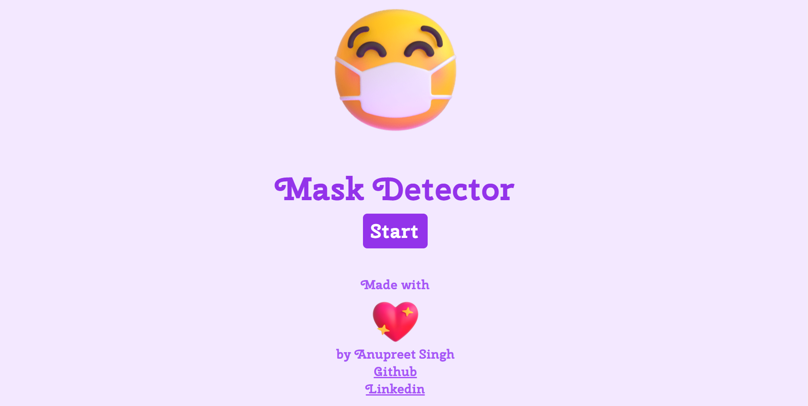

# maskDetector (https://realanupreet.github.io/maskDetector/)

[Problem statement]: To track if the people are wearing a mask or not.

As the health risks rise day by day due to various viruses we need ways to protect ourselves and our family via technology that can be used in an efficient and effective manner. The technology that can have advantage is computer vision with which the users can be identified if they are wearing a mask or not.

## [Demo](https://realanupreet.github.io/maskDetector/) 

 

